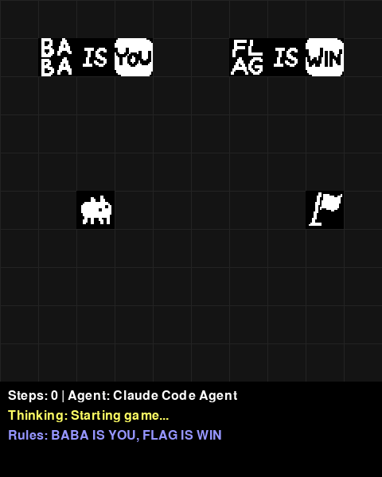

# Baba Is AGI

A Python implementation of Baba Is You designed for AI agent development. Build autonomous agents to solve puzzles through rule manipulation and strategic planning.

<table>
<tr>
<td width="50%">

### Game Demo

*Classic Baba Is You gameplay*

</td>
<td width="50%">

### AI Agent with Reasoning

*Claude Code agent showing its thinking process*

</td>
</tr>
</table>

### Agent Comparison

<table>
<tr>
<th align="center">Puzzle</th>
<th align="center">Demo Agent (Greedy Pathfinding)</th>
<th align="center">Claude Code Agent (AI with Reasoning)</th>
</tr>
<tr>
<td align="center"><b>Simple</b></td>
<td align="center">✅ Solves easily<br/><i>Direct path to goal</i></td>
<td align="center"><br/>✅ Solves in 8 steps<br/><i>Shows reasoning: "move toward flag"</i></td>
</tr>
<tr>
<td align="center"><b>Push Puzzle</b></td>
<td align="center"><br/>❌ Gets stuck immediately<br/><i>Tries to move through rocks</i></td>
<td align="center"><br/>🔄 Attempts multiple strategies<br/><i>Pushes rocks, explores alternatives</i></td>
</tr>
</table>

The comparison shows how different agent architectures handle varying puzzle complexity. The demo agent uses simple pathfinding while the Claude Code agent can reason about game mechanics and display its thinking process in the UI.

> **⚠️ Important**: This project includes a level loader and sprite system that can work with official Baba Is You game files. These features **require you to own the game on Steam**. The project works without these files using custom ASCII sprites and built-in environments.

## Features

- Complete game engine with dynamic rule system
- 120+ objects from the original game
- Custom ASCII-based sprites (always available)
- Level loader for official Baba Is You levels (requires game ownership)
- Gym-like environment API for easy integration
- Simple agent interface - just implement `get_action()`
- Claude Code agent with reasoning display in UI
- 14 built-in environments of varying difficulty

## Installation

```bash
# Install pixi
curl -fsSL https://pixi.sh/install.sh | bash

# Install dependencies
pixi install
```

### Optional: Official Game Content (Requires Game Ownership)

**⚠️ IMPORTANT**: The following features require you to own Baba Is You on Steam:
- Loading official game sprites
- Loading official level files (.l format)

If you own the game on Steam:
```bash
# Copy official sprites from your Steam installation
pixi run setup-sprites
```

The game will automatically use custom ASCII sprites if official sprites are not available.

## Quick Start

### Play Interactively

```bash
pixi run play
```

Controls: Arrow keys/WASD to move, R to reset, Q to quit

### Play with AI Agents

```bash
# Watch a random agent play
pixi run agent-random

# Run demo agent with pathfinding
pixi run agent-demo

# Run Claude Code agent with reasoning display (requires claude-code CLI)
pixi run agent-claude

# List all available environments
pixi run list-envs
```

### Load Official Levels

**⚠️ Requires game ownership**: This feature only works if you own Baba Is You on Steam.

```python
from baba.level_loader import LevelLoader
from baba.registration import Registry

loader = LevelLoader()  # Automatically finds Steam installation
registry = Registry()

# Load level from official game files
try:
    grid = loader.load_level("baba", 0, registry)
except FileNotFoundError:
    print("Official levels not found. Please own the game on Steam.")
```

## Creating Custom Agents

The project uses a Gym-like API, making it easy to create agents:

#### Basic Agent Example

```python
from baba import Agent, make

class MyAgent(Agent):
    def __init__(self):
        super().__init__("My Custom Agent")
        
    def get_action(self, observation):
        # Analyze grid state and return action
        # observation is a Grid object with game state
        # Return one of: "up", "down", "left", "right", "wait"
        return "right"

# Create environment and agent
env = make("simple")
agent = MyAgent()

# Play one episode with visualization
stats = agent.play_episode(env, render=True)
print(f"Won: {stats['won']}, Steps: {stats['steps']}")

# Or play many episodes for evaluation
stats = agent.play_episodes(env, num_episodes=100, render=False)
print(f"Win rate: {stats['win_rate']*100:.1f}%")
```

### Environment API (Gym-like)

```python
# Reset environment
obs = env.reset()  # Returns Grid object

# Take a step
obs, reward, done, info = env.step("right")
# reward: 1.0 (win), -1.0 (loss), 0.0 (otherwise)
# done: True if episode ended
# info: dict with 'won', 'lost', 'steps'

# Render current state
img = env.render()  # Returns RGB array
```

#### Claude Code Agent

The project includes a Claude Code agent that uses AI to play the game:

```python
from agents.claude_code_agent import ClaudeCodeAgent

agent = ClaudeCodeAgent(verbose=True)
# Agent will display its reasoning in the UI:
# "Moving toward flag", "Need to push rock", etc.
```

## Game Rules

Rules are formed by arranging text blocks:
- `BABA IS YOU` - Control Baba
- `FLAG IS WIN` - Touch flag to win
- `WALL IS STOP` - Walls block movement
- `ROCK IS PUSH` - Rocks can be pushed
- `BABA IS WALL` - Transform Baba into walls

## Project Structure

```
baba-is-agi/
├── baba/                # Core game engine
│   ├── grid.py         # Game grid and mechanics
│   ├── rule.py         # Rule parsing system
│   ├── world_object.py # Game objects
│   └── envs.py         # Pre-built environments
├── agents/             # Example agent implementations
├── scripts/            # Utility scripts
├── tests/              # Comprehensive test suite (102 tests)
└── docs/               # Documentation
```

## Available Environments

Basic:
- `simple` - Introduction level
- `wall_maze` - Navigate walls
- `push_puzzle` - Push objects

Advanced:
- `make_win` - Create WIN rule
- `two_room_break_stop` - Break rules to pass
- `transform_puzzle` - Use transformations
- `rule_chain` - Complex rule sequences

List all with: `pixi run list-envs`

## Documentation

The codebase is extensively documented with detailed inline comments explaining:
- Game mechanics and rule system
- Object interactions and transformations  
- Level design and environment structure
- Agent development patterns

Additional documentation:
- [Level Format](docs/level_format_analysis.md) - Official .l file structure (for reference)
- [Level Loader](docs/level_loader_documentation.md) - Loading official levels (requires game)
- [Object Reference](docs/object_reference.md) - Complete object listing

## Copyright Notice

**Baba Is You** is a game by Arvi "Hempuli" Teikari. This project is an independent implementation for AI research purposes.

- **Game Content**: Official sprites and level files are copyrighted material. You must own Baba Is You to use these features.
- **This Project**: The Python implementation and AI agents are independent work, not affiliated with or endorsed by Hempuli.
- **Custom Assets**: This project includes custom ASCII-based sprites as an alternative to official game assets.

## License

This implementation is based on [baba-is-ai](https://github.com/nacloos/baba-is-ai).