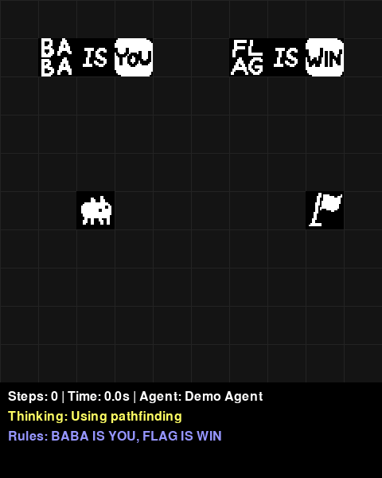
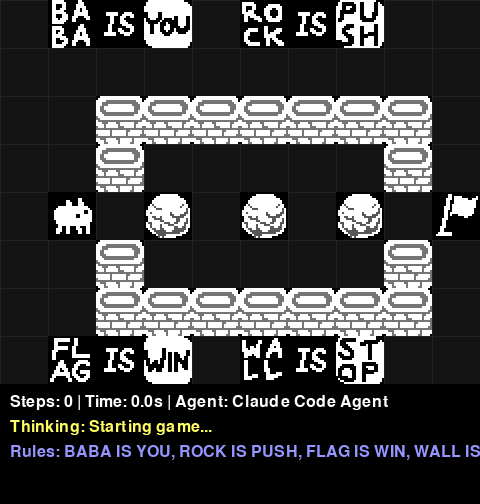

# Baba Is AGI

> **Important**: This project includes a level loader and sprite system that can work with official Baba Is You game files. These features **require you to own the game on Steam**. The project works without these files using custom ASCII sprites and built-in environments.

A Python implementation of Baba Is You for testing AI agents. This repository provides a game engine, environment API, and example agents.

## Agent Comparison

<table>
<tr>
<th align="center">Puzzle</th>
<th align="center">Demo Agent (BFS Pathfinding)</th>
<th align="center">Claude Code Agent (<a href="docs/claude_code_agent_design.md">Design Details</a>)</th>
</tr>
<tr>
<td align="center"><b>Simple</b></td>
<td align="center"><br/>Solves in 6 steps<br/><i>BFS pathfinding</i></td>
<td align="center"><br/>Solves in 6 steps<br/><i>Shows: "Move baba right toward flag at (8,5)"</i></td>
</tr>
<tr>
<td align="center"><b>Push Puzzle</b></td>
<td align="center"><br/>20 steps: Pushes rocks, gets stuck<br/><i>BFS pathfinding with push handling</i></td>
<td align="center"><br/>50 steps: Attempts a few exploration strategies<br/><i>but has trouble reasoning spatially</i></td>
</tr>
</table>

This comparison shows two included example agents:
- **Demo Agent**: Uses BFS pathfinding to navigate and push objects
- **Claude Code Agent**: Uses the Claude API to select actions based on game state

## What This Repository Provides

### Core Components
- Baba Is You game engine with rule system
- 120+ game objects and properties
- 14 built-in puzzle environments
- Gym-like environment API (`reset()`, `step()`, `render()`)

### Agent Development
- Simple agent interface - implement `get_action(observation)`
- Grid observation with game state information
- Built-in episode management and recording

### Example Agents
- Random agent - baseline performance
- Demo agent - BFS pathfinding with object pushing
- Claude Code agent - uses Claude API (requires claude-code CLI)

### Optional Features
- Level loader for official game files (requires Steam ownership)
- Official sprite support (requires Steam ownership)
- Custom ASCII sprites (always available)

## Installation

```bash
# Install pixi
curl -fsSL https://pixi.sh/install.sh | bash

# Install dependencies
pixi install
```

### Optional: Official Game Content (Requires Game Ownership)

**IMPORTANT**: The following features require you to own Baba Is You on Steam:
- Loading official game sprites
- Loading official level files (.l format)

If you own the game on Steam:
```bash
# Copy official sprites from your Steam installation
pixi run setup-sprites
```

The game will automatically use custom ASCII sprites if official sprites are not available.

## Quick Start

### Play Interactively

```bash
pixi run play
```

Controls: Arrow keys/WASD to move, R to reset, Q to quit

### Play with AI Agents

```bash
# Watch a random agent play
pixi run agent-random

# Run demo agent with pathfinding
pixi run agent-demo

# Run Claude Code agent with reasoning display (requires claude-code CLI)
pixi run agent-claude

# List all available environments
pixi run list-envs
```

### Load Official Levels

**Requires game ownership**: This feature only works if you own Baba Is You on Steam.

```python
from baba.level_loader import LevelLoader
from baba.registration import Registry

loader = LevelLoader()  # Automatically finds Steam installation
registry = Registry()

# Load level from official game files
try:
    grid = loader.load_level("baba", 0, registry)
except FileNotFoundError:
    print("Official levels not found. Please own the game on Steam.")
```

## Creating Custom Agents

The project uses a Gym-like API, making it easy to create agents:

#### Basic Agent Example

```python
from baba import Agent, make

class MyAgent(Agent):
    def __init__(self):
        super().__init__("My Custom Agent")
        
    def get_action(self, observation):
        # Analyze grid state and return action
        # observation is a Grid object with game state
        # Return one of: "up", "down", "left", "right", "wait"
        return "right"

# Create environment and agent
env = make("simple")
agent = MyAgent()

# Play one episode with visualization
stats = agent.play_episode(env, render=True)
print(f"Won: {stats['won']}, Steps: {stats['steps']}")

# Or play many episodes for evaluation
stats = agent.play_episodes(env, num_episodes=100, render=False)
print(f"Win rate: {stats['win_rate']*100:.1f}%")
```

### Environment API

```python
# Reset environment
obs = env.reset()  # Returns Grid object

# Take a step
obs, reward, done, info = env.step("right")
# reward: 1.0 (win), -1.0 (loss), 0.0 (otherwise)
# done: True if episode ended
# info: dict with 'won', 'lost', 'steps'

# Render current state
img = env.render()  # Returns RGB array
```

#### Claude Code Agent Example

```python
from agents.claude_code_agent import ClaudeCodeAgent

agent = ClaudeCodeAgent(verbose=True)
# Displays reasoning in UI during gameplay
```

## Game Rules

Rules are formed by arranging text blocks:
- `BABA IS YOU` - Control Baba
- `FLAG IS WIN` - Touch flag to win
- `WALL IS STOP` - Walls block movement
- `ROCK IS PUSH` - Rocks can be pushed
- `BABA IS WALL` - Transform Baba into walls

## Project Structure

```
baba-is-agi/
├── baba/                 # Core game implementation
│   ├── grid.py           # Game grid and main logic
│   ├── world_object.py   # Game objects and text blocks
│   ├── rule.py           # Rule parsing and management
│   ├── properties.py     # Game properties (YOU, WIN, STOP, etc.)
│   ├── rendering.py      # Basic rendering utilities
│   ├── sprites.py        # Custom ASCII sprite generation
│   ├── sprite_loader.py  # Loads official sprites if available
│   ├── level_loader.py   # Loads official Baba Is You levels
│   ├── envs.py           # All game environments (14 total)
│   ├── agent.py          # Base Agent class
│   └── assets/sprites/   # Directory for official game sprites (gitignored)
├── agents/               # Agent implementations
│   ├── random_agent.py   # Simple random agent
│   ├── demo_agent.py     # Greedy pathfinding agent
│   └── claude_code_agent.py # Claude API agent
├── scripts/              # Utility scripts
├── tests/                # Comprehensive test suite (102 tests)
├── docs/                 # Documentation
└── pixi.toml            # Dependency management
```

## Available Environments

Basic:
- `simple` - Introduction level
- `wall_maze` - Navigate walls
- `push_puzzle` - Push objects

Advanced:
- `make_win` - Create WIN rule
- `two_room_break_stop` - Break rules to pass
- `transform_puzzle` - Use transformations
- `rule_chain` - Complex rule sequences

List all with: `pixi run list-envs`

## Documentation

- [Claude Code Agent Design](docs/claude_code_agent_design.md) - How the Claude agent receives and processes game state
- [Object Reference](docs/object_reference.md) - Complete list of game objects
- [Level Loader](docs/level_loader_documentation.md) - Loading official levels (requires game ownership)
- [Level Format](docs/level_format_analysis.md) - Official .l file format reference

## Copyright Notice

**Baba Is You** is a game by Arvi "Hempuli" Teikari. This project is an independent implementation for AI research purposes.

- **Game Content**: Official sprites and level files are copyrighted material. You must own Baba Is You to use these features.
- **This Project**: The Python implementation and AI agents are independent work, not affiliated with or endorsed by Hempuli.
- **Custom Assets**: This project includes custom ASCII-based sprites as an alternative to official game assets.

## License

This implementation is based on [baba-is-ai](https://github.com/nacloos/baba-is-ai).
