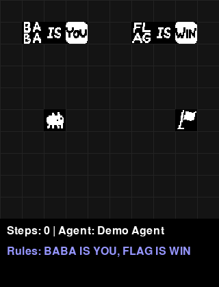

# Baba Is AGI

A Python implementation of Baba Is You designed for AI agent development. Build autonomous agents to solve puzzles through rule manipulation and strategic planning.



> **⚠️ Important**: This project includes a level loader and sprite system that can work with official Baba Is You game files. These features **require you to own the game on Steam**. The project works without these files using custom ASCII sprites and built-in environments.

## Features

- Complete game engine with dynamic rule system
- 120+ objects from the original game
- Custom ASCII-based sprites (always available)
- Level loader for official Baba Is You levels (requires game ownership)
- Clean agent system: UserAgent (human) and ClaudeCodeAgent (AI)
- 14 built-in environments of varying difficulty

## Installation

```bash
# Install pixi
curl -fsSL https://pixi.sh/install.sh | bash

# Install dependencies
pixi install
```

### Optional: Official Game Content (Requires Game Ownership)

**⚠️ IMPORTANT**: The following features require you to own Baba Is You on Steam:
- Loading official game sprites
- Loading official level files (.l format)

If you own the game on Steam:
```bash
# Copy official sprites from your Steam installation
pixi run setup-sprites
```

The game will automatically use custom ASCII sprites if official sprites are not available.

## Quick Start

### Play Interactively

```bash
pixi run play
```

Controls: Arrow keys/WASD to move, R to reset, Q to quit

### Play with AI Agent

```bash
# Watch Claude play (requires ANTHROPIC_API_KEY)
pixi run play --agent claude

# Run Claude on a specific level
pixi run play --env push_puzzle --agent claude

# Run multiple episodes without rendering
pixi run play --agent claude --episodes 10 --no-render
```

### Load Official Levels

**⚠️ Requires game ownership**: This feature only works if you own Baba Is You on Steam.

```python
from baba.level_loader import LevelLoader
from baba.registration import Registry

loader = LevelLoader()  # Automatically finds Steam installation
registry = Registry()

# Load level from official game files
try:
    grid = loader.load_level("baba", 0, registry)
except FileNotFoundError:
    print("Official levels not found. Please own the game on Steam.")
```

## Creating Custom Agents

```python
from baba import Agent, make, EpisodePlayer

class MyAgent(Agent):
    def __init__(self):
        super().__init__("My Custom Agent")
        
    def get_action(self, grid):
        # Analyze grid state and return action
        # Options: "up", "down", "left", "right", "wait"
        return "right"

# Use your agent
env = make("simple")
agent = MyAgent()

# Play episodes
player = EpisodePlayer(env, agent)
won, lost, steps = player.play_episode()
```

## Game Rules

Rules are formed by arranging text blocks:
- `BABA IS YOU` - Control Baba
- `FLAG IS WIN` - Touch flag to win
- `WALL IS STOP` - Walls block movement
- `ROCK IS PUSH` - Rocks can be pushed
- `BABA IS WALL` - Transform Baba into walls

## Project Structure

```
baba-is-agi/
├── baba/                # Core game engine
│   ├── grid.py         # Game grid and mechanics
│   ├── rule.py         # Rule parsing system
│   ├── world_object.py # Game objects
│   └── envs.py         # Pre-built environments
├── agent/              # AI agent implementations
├── scripts/            # Utility scripts
├── tests/              # Comprehensive test suite (102 tests)
└── docs/               # Documentation
```

## Available Environments

Basic:
- `simple` - Introduction level
- `wall_maze` - Navigate walls
- `push_puzzle` - Push objects

Advanced:
- `make_win` - Create WIN rule
- `two_room_break_stop` - Break rules to pass
- `transform_puzzle` - Use transformations
- `rule_chain` - Complex rule sequences

List all with: `pixi run python scripts/list_environments.py`

## Documentation

The codebase is extensively documented with detailed inline comments explaining:
- Game mechanics and rule system
- Object interactions and transformations  
- Level design and environment structure
- Agent development patterns

Additional documentation:
- [Level Format](docs/level_format_analysis.md) - Official .l file structure (for reference)
- [Level Loader](docs/level_loader_documentation.md) - Loading official levels (requires game)
- [Object Reference](docs/object_reference.md) - Complete object listing

## Copyright Notice

**Baba Is You** is a game by Arvi "Hempuli" Teikari. This project is an independent implementation for AI research purposes.

- **Game Content**: Official sprites and level files are copyrighted material. You must own Baba Is You to use these features.
- **This Project**: The Python implementation and AI agents are independent work, not affiliated with or endorsed by Hempuli.
- **Custom Assets**: This project includes custom ASCII-based sprites as an alternative to official game assets.

## License

This implementation is based on [baba-is-ai](https://github.com/nacloos/baba-is-ai).